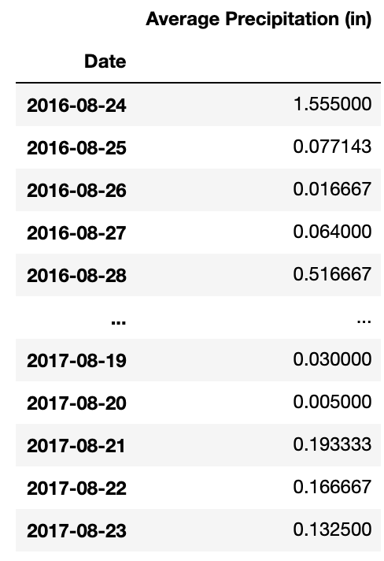
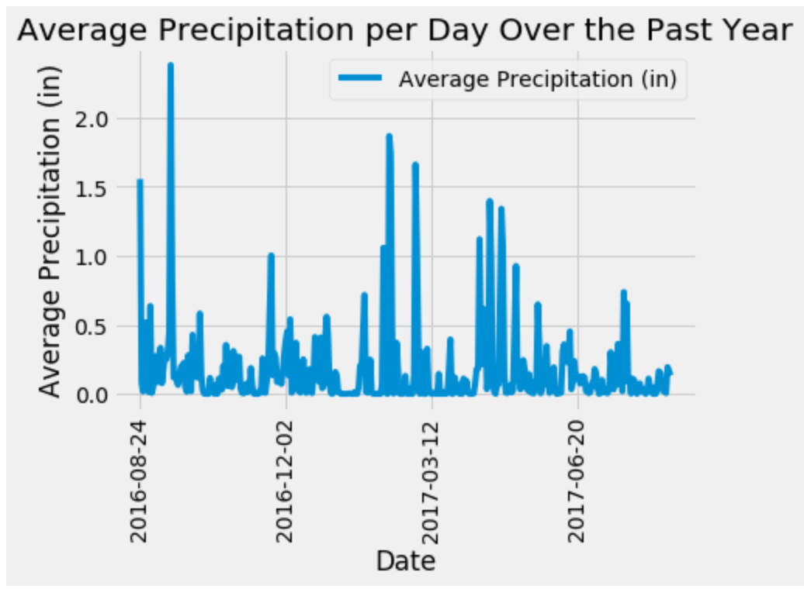
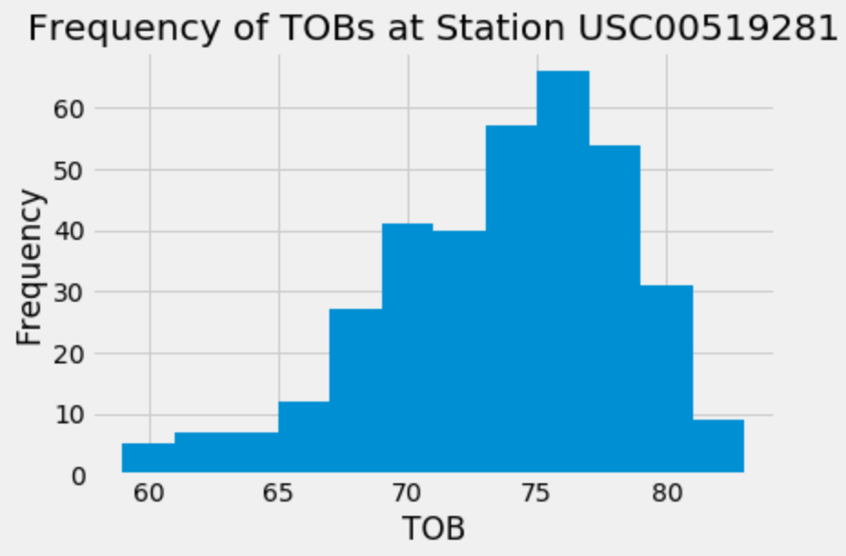
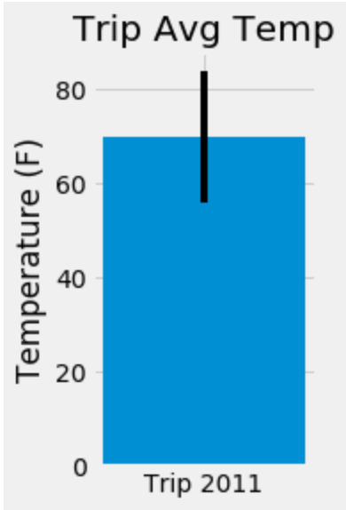
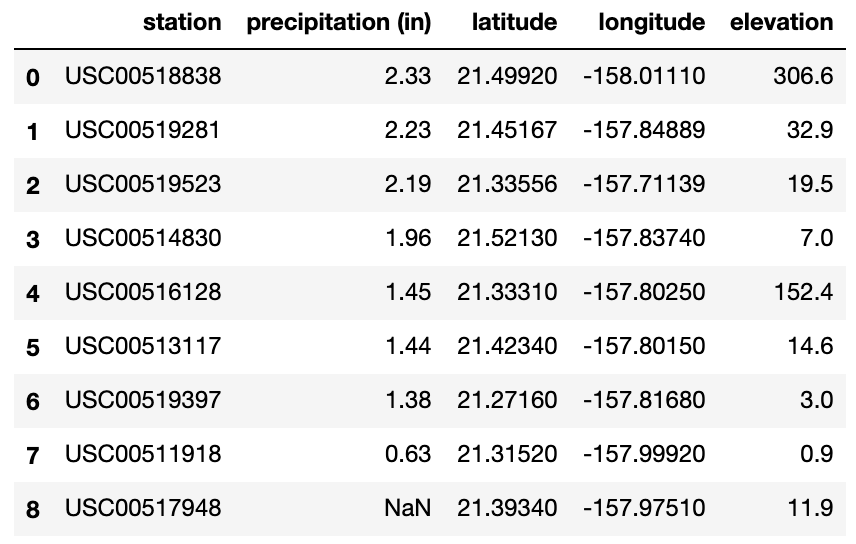
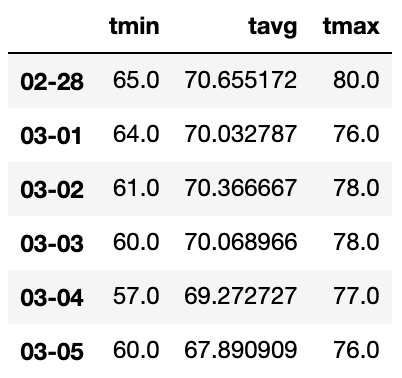
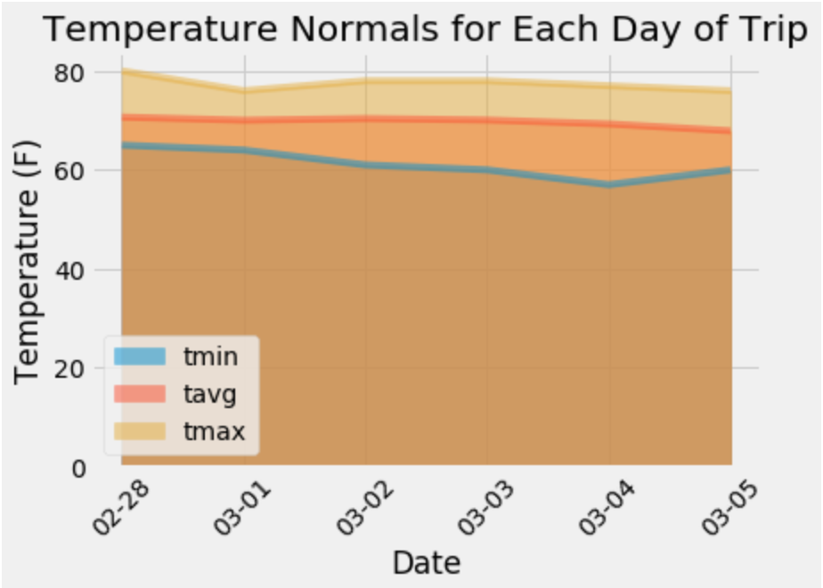
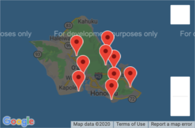

### Problem this analysis is trying to solve:
Everyone hopes they have great weather when they go on vacation. It can be hard to plan a vacation in advanced because you are unsure what the weather is going to be like. This app tracks the precipitation and temperature of 9 locations in Hawaii over the past few years so that users can enter in the dates they are planning on going on vacation to see what the precipitation and temperatures of that date range were in past years. Users can use the patterns of previous years to predict the best time for them to go on their trip.

### How to run the code:
1. Download and save all the files of the respository (except the items in the figures folder) to a folder on your computer.
1. Open your terminal.
1. cd into the folder you saved the files in.
1. Run the command "jupyter notebook". This will open the folder in the Jupyter Notebook website.
1. Open up the "climate_analysis.ipynb" file on Jupyter Notebook.
1. At the top, under the "Kernal" tab, click "Restart & Run All". This will run all the cells on the page and display all the dataframes graphs.
1. Exit out of Jupyter notebook in your terminal but pressing control+c.
1. Run the command "python app.py" in your terminal. This will run the file "app.py".
1. In your broswer, go to "http://localhost:5000" This will bring you to my API homepage.
1. On the homepage, there will be a list of all the available routes. Go to each one by copy and pasting the route after "http://localhost:5000" in your broswer.
   1. To access the "/api/v1.0/<star>" and "/api/v1.0/<start>/<end>" routes, enter in dates in place of <start> and <end> in the format "yyyy-mm-dd".

### Data Collected:

### Why the data is displayed this way:
For the average precipitation per day over the past year, I displayed the data first in a dataframe and then in a line graph so users could quickly see which times of the year get the most precipitation. I also found the average precipitation per day by averaging the data from 9 different stations in order to condense the amount of rows in the dataframe and so that there would only be one line in the line graph. The frequency of TOBs at Station USC00519281 is a histogram because it is displaying how often each temperature was observed at that station, which is the most active station in the database. The "Trip Avg Temp" figure is diplaying the average temperature for a given range of dates that the user enters. The error bars on this graph display the range of the high and low temperatures of that same date range. The dataframe about each station is displayed in a dataframe so users can quickly see each station's location and the average precipitation recorded at each. The temperature normals for each day of a given trip is diplayed in both a dataframe and area plot so users can see, based on all the previous years' data, if the dates they want to go on their trip will have favorable conditions and plan accordingly. The map of Hawaii has markers on it to show exactly where each station in the data set is located.
